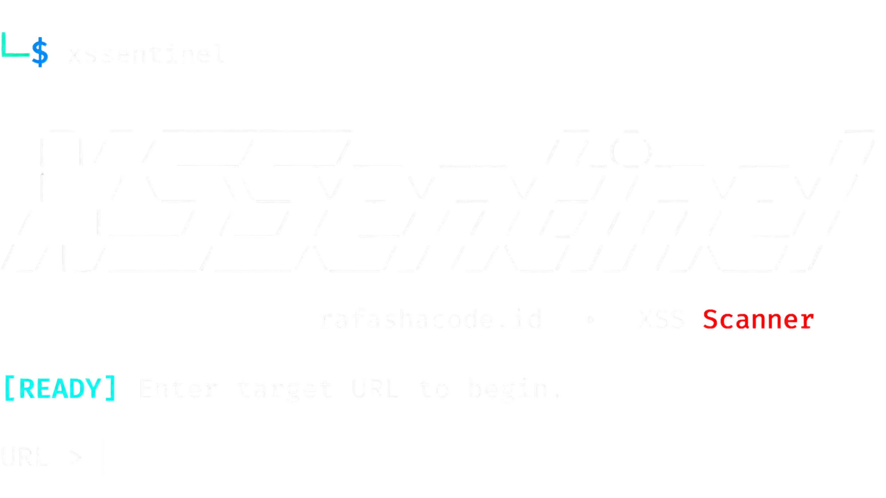
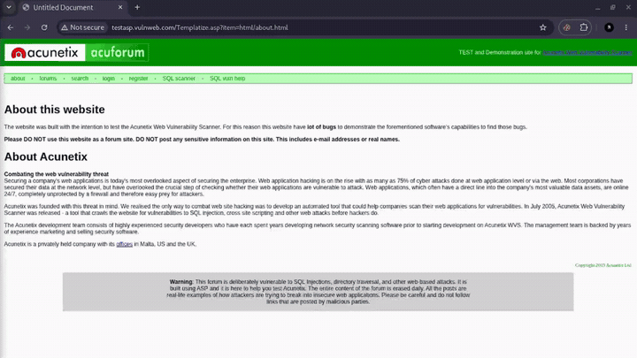

<div align="center">



<br><br>

<h1>XSSentinel</h1>

<p>
  <strong>CLI scanner for authorized XSS testing with reflection checks, browser validation, API evidence, CSP hints, and practical terminal output.</strong>
</p>

<p>
  <a href="https://www.python.org/"></a>
  
  
  
</p>

</div>

## Demo

<div align="center">



</div>

## Overview

XSSentinel helps testers review reflected XSS, DOM XSS risk, and API responses that reflect input. It is designed for authorized security testing and gives readable evidence so findings are easier to confirm manually.

XSSentinel does not mark every reflection as confirmed XSS. It separates confirmed browser execution from lower-confidence reflection, API, and risk signals.

## Features

- Scans GET and POST input surfaces discovered from a target URL.
- Tests one parameter at a time by default for clearer evidence.
- Supports multi-parameter testing with `--all-params`.
- Prioritizes high-signal payloads first.
- Shows practical finding markers: `[VALID]`, `[API]`, `[RISK]`, `[LOW]`, `[NO]`, and `[SKIP]`.
- Uses Chromium or Playwright when available for browser confirmation.
- Provides CSP, WAF-like, API, and DOM-risk hints.

## Responsible Use

Use XSSentinel only on applications you own or have explicit permission to test. Unauthorized scanning can disrupt systems and may violate laws, contracts, or acceptable-use policies.

## Installation

```bash
git clone https://github.com/rafashaalfiandi/XSSentinel.git
cd XSSentinel
chmod +x install.sh
./install.sh
```

Verify the command:

```bash
xssentinel -h
```

If `xssentinel` is not found, add `~/.local/bin` to your `PATH`:

```bash
export PATH="$HOME/.local/bin:$PATH"
```

## Usage

Scan a target URL:

```bash
xssentinel "https://target.test/search?q=test"
```

Scan a URL with multiple parameters:

```bash
xssentinel "https://target.test/search?q=test&category=test"
```

Send each test to all parameters at once:

```bash
xssentinel --all-params "https://target.test/search?q=test&category=test"
```

Stop after the first confirmed finding:

```bash
xssentinel --stop-on-confirmed "https://target.test/search?q=test"
```

Update the installed tool:

```bash
xssentinel -update
```

Show help:

```bash
xssentinel -h
```

## Output Markers

| Marker | Meaning |
| --- | --- |
| `[VALID]` | Browser execution was confirmed. |
| `[API]` | An API or data response reflected input and needs manual sink validation. |
| `[RISK]` | Strong reflection signal, but browser execution was not confirmed. |
| `[LOW]` | Reflection exists, but confidence is lower. |
| `[NO]` | No useful evidence was found for that attempt. |
| `[SKIP]` | The target was unreachable or skipped after repeated unsuitable responses. |

## Browser Validation

XSSentinel can use a local Chromium browser or Playwright to confirm execution. If browser support is unavailable, scans still run, but results are based on HTTP and reflection evidence.

Install Chromium on Debian/Ubuntu-based systems:

```bash
sudo apt install chromium
```

Or install Playwright support:

```bash
python3 -m pip install playwright
python3 -m playwright install chromium
```

## Troubleshooting

### `xssentinel: command not found`

Add `~/.local/bin` to your `PATH`:

```bash
export PATH="$HOME/.local/bin:$PATH"
xssentinel -h
```

### Browser validation is disabled

Install Chromium or Playwright, then run the scan again.

### `[API]` appears but there is no popup

That is expected. API responses usually return data instead of rendering HTML directly. Treat `[API]` as evidence that needs manual validation in the frontend that consumes the response.

### Many `[RISK]` or `[LOW]` results appear

The payload was reflected, but execution was not confirmed. Common causes include browser validation being unavailable, sanitization, CSP, or the endpoint returning data instead of rendered HTML.

### The scan feels slow

Large targets and many discovered inputs can take longer. Start with a specific URL when you want a faster focused scan.

## Uninstall

```bash
./uninstall.sh
```

## License

XSSentinel is released under the Apache License 2.0. See [LICENSE](LICENSE) for details.
